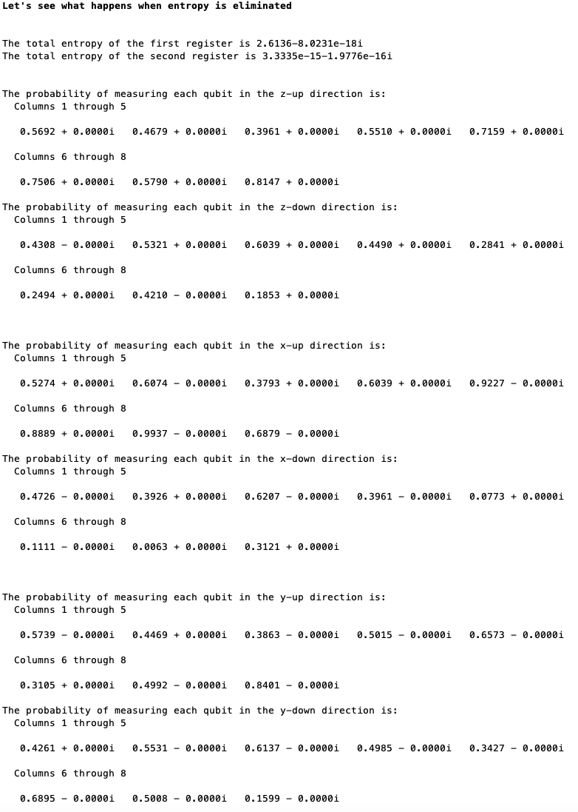
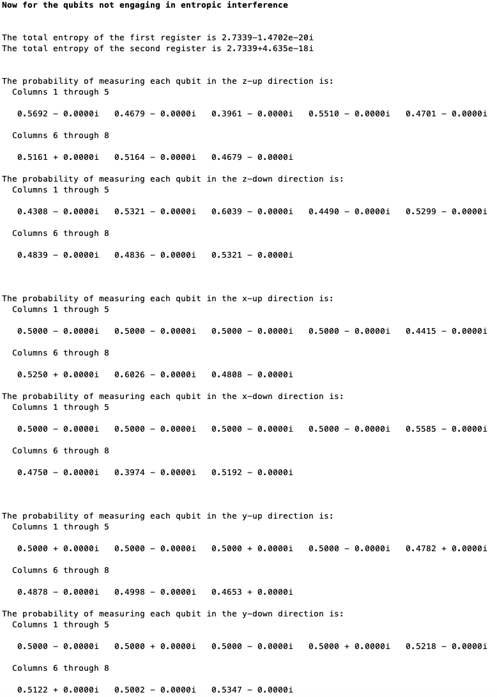
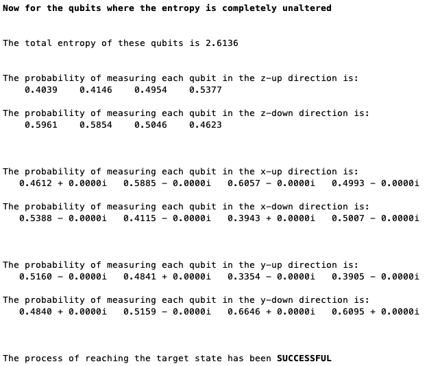

================================================================
Presenting the code for the basic setup of non-Hermitian driving
================================================================

The first part of this documentation gives the main MATLAB file along with explanatory comments that let's you see how the process of non-Hermitian driving is set up. This is followed by a series of helper functions that are needed for the code to work properly.

.. code-block:: matlab

   clear;
   clc;
   % nqubits defines how many qubits are in each of the two registers
   nqubits = 4;
   % unitary determines whether the qubits in the second register are subject
   % to unitary (they are subject to a unitary if set to 'a' as opposed to 'b') in addition to
   % also being subject to noise
   unitary = 'a';
   % If state is set to 'a', then the target states of each of the qubits in
   % the second register are set to a random orientation. If state is set to
   % 'b', the target states of the qubits in the second register are set to
   % the spin down state
   state = 'a';
   % Define the Hadamard gate
   Hadamard = [1 1; 1 -1]/sqrt(2);
   % Generate foreunit, which is a matrix of random real and imaginary values
   foreunit = zeros(2^(nqubits));
   for i = 1:(2^(nqubits))
       for j = 1:(2^(nqubits))
           foreunit(i,j) = -1 + 2*rand - 1i + 2i*rand;
       end
   end
   % Generate a Hermitian Hamiltonian acunit using foreunit
   acunit = foreunit + ctranspose(foreunit);
   % Generate the time evolution matrix that time evolves the qubits in the
   % second register using the Hamiltonian acunit
   timeunit = kron(eye(2^nqubits),expm(-1i*acunit*16));
   % Generate a generic time evolution matrix using the Hamiltonian acunit
   timeunit2 = expm(-1i*acunit*16);
   % Determine the kets for each of the qubits in the second register that
   % define the target states and the states orthogonal to the target states
   tarstates = zeros(2,2,nqubits);
   % If state is set to 'a', then the target states of each of the qubits in
   % the second register are set to a random orientation.
   if (state=='a')
       for i = 1:nqubits
           % Generate two random orthogonal kets for each qubit
           [orthvec] = FindOrths([],2);
           tarstates(:,:,i) = orthvec;
       end
   else
       for i = 1:nqubits
           % Set the target state to the spin down state for each of the
           % qubits
           tarstates(:,1,i) = [1; 0];
           % Set the state orthogonal to the target state to be the spin up
           % state for each of the qubits
           tarstates(:,2,i) = [0; 1];
       end
   end
   % Generate the unitaries interference and rotation. interference
   % is equal to the outer product of the target state with itself minus the
   % outer product of the orthogonal state with itself. rotation rotates a
   % qubit from the target state to the orthogonal state and vice versa.
   [interference,rotation] = StateProcessing(tarstates);
   % Create a state vector tarwave that corresponds to the state where all the
   % qubits are in their target state
   tarwave = tarstates(:,1,1);
   for i = 2:nqubits
       tarwave = kron(tarwave,tarstates(:,1,i));
   end
   % Generate the controlled unitary czs that applies a phase of negative one if
   % the control qubit in the first register is in the spin up state and the
   % corresponding target qubit in register is in the state orthogonal to the
   % target state
   czs = zeros(2^(2*nqubits));
   % Iterate over all possible configurations of the qubits in the first
   % register
   for i = 0:(2^nqubits-1)
       % Turn i into a binary string that is nqubits long
       const = dec2bin(i);
       const2 = nqubits - length(const);
       for j = 1:const2
           const = ['0' const];
       end
       wavemat = zeros(2,nqubits);
       opmat = zeros(2,2,nqubits);
       for j = 1:nqubits
           % If the jth element of const is equal to '1', set the ket for the
           % jth qubit to be in the spin up state and have the appropriate
           % matrix stored within interference operate on the target qubit.
           if (const(j)=='1')
               wavemat(:,j) = [0; 1];
               opmat(:,:,j) = interference(:,:,j);
           % Otherwise set the ket for the jth qubit to be in the spin down
           % state and have an identity matrix operate on the target qubit.
           else
               wavemat(:,j) = [1; 0];
               opmat(:,:,j) = [1 0; 0 1];
           end
       end
       % Create the ket statemat that describes the appropriate state for the
       % qubits in the first register as well as the unitary statemat2 that
       % describes the operations performed on the qubits in the second
       % register.
       statemat = kron(wavemat(:,1),wavemat(:,2));
       statemat2 = kron(opmat(:,:,1),opmat(:,:,2));
       for j = 3:nqubits
           statemat = kron(statemat,wavemat(:,j));
           statemat2 = kron(statemat2,opmat(:,:,j));
       end
       % Turn statemat into a density matrix
       statemat = statemat*ctranspose(statemat);
       % Add the operations for this iteration into the controlled unitary czs
       czs = czs + kron(statemat,statemat2);
   end
   % Generate the matrix Hadamat that applies Hadamard gates to all of the
   % qubits in the first register.
   Hadamat = Hadamard;
   for i = 2:nqubits
       Hadamat = kron(Hadamat,Hadamard);
   end
   for i =1:nqubits
       Hadamat = kron(Hadamat,[1 0; 0 1]);
   end
   % Create the initial state wave, which sets all of the qubits in the two
   % registers to be in the spin down state.
   wave = [1; 0];
   for i = 2:(2*nqubits)
       wave = kron(wave,[1; 0]);
   end
   % Create the initial state waveb, which will describe a system composed of
   % the qubits in register that are unacted upon by the qubits in register
   % one
   waveb = [1; 0];
   for i = 2:nqubits
       waveb = kron(waveb,[1; 0]);
   end
   % Create density matrices density and densityb out of wave and waveb,
   % respectively
   density = wave*ctranspose(wave);
   densityb = waveb*ctranspose(waveb);
   % If unitary is set to 'a', apply the random unitary to the qubits in the
   % second register for density and to all the qubits for densityb
   if (unitary=='a')
       density = timeunit*density*ctranspose(timeunit);
       densityb = timeunit2*densityb*ctranspose(timeunit2);
   end
   density = density/trace(abs(density));
   densityb = densityb/trace(abs(densityb));
   % Apply a series of Kraus operators to density, where the number of times
   % that these Kraus operators are applied is determined by the last argument
   densityf = PauliKraus(density,(nqubits+1):(2*nqubits),2*nqubits,[0.02 0.02 0.02 0.94],10);
   density = densityf;
   % Apply a series of Kraus operators to densityb
   densityf = PauliKraus(densityb,1:nqubits,nqubits,[0.02 0.02 0.02 0.94],10);
   densityb = densityf;
   clear densityf
   % Apply the Hadamard gates to the qubits in the first register for density
   density = Hadamat*density*ctranspose(Hadamat);
   % Apply the controlled unitary czs to density
   density = czs*density*ctranspose(czs);
   % Apply the Hadamard gates to the qubits in the first register for density
   density = Hadamat*density*ctranspose(Hadamat);
   % Generate the density matrix density2 using density
   density2 = density;
   % Apply the controlled unitary that brings all of the qubits in the second
   % register into their desired target states
   densityf = SpinCorrection(density,nqubits,rotation);
   density = densityf;
   % Create a density matrix using the idealized state where all of the qubits
   % in the second register are in their target states and the qubits in the
   % first register are not included
   tarrho = tarwave*ctranspose(tarwave);
   % Calculate the total entropy of the qubits in the first and second
   % register for the density matrix density using firstent and secondent.
   firstent = 0;
   secondent = 0;
   % Iterate through all of the qubits in the first register
   for i = 1:nqubits
       % Calculate the reduced density matrix for the ith qubit
       rdensity = ReducedDensity(density,2*nqubits,i);
       % Obtain the von Neumann entropy for the ith qubit
       entropy = -trace(rdensity*logm(rdensity));
       if isnan(entropy)
           entropy = 0;
       end
       % Add this von Neumann entropy to firstent
       firstent = firstent + entropy;
   end
   % Iterate through all of the qubits in the secon register
   for i = (nqubits+1):(2*nqubits)
       % Calculate the reduced density matrix for the ith qubit
       rdensity = ReducedDensity(density,2*nqubits,i);
       % Obtain the von Neumann entropy for the ith qubit
       entropy = -trace(rdensity*logm(rdensity));
       if isnan(entropy)
           entropy = 0;
       end
       % Add this von Neumann entropy to secondent
       secondent = secondent + entropy;
   end
   % Display the results
   disp('<strong>Let''s see what happens when entropy is eliminated</strong>')
   disp(' ')
   disp(' ')
   disp(['The total entropy of the first register is ' num2str(firstent)])
   disp(['The total entropy of the second register is ' num2str(secondent)])
   disp(' ')
   disp(' ')
   % Calculate the total entropy of the first and second register for the
   % density matrix that does not have the correction unitary act on it
   firstent2 = 0;
   secondent2 = 0;
   for i = 1:nqubits
       rdensity = ReducedDensity(density2,2*nqubits,i);
       entropy = -trace(rdensity*logm(rdensity));
       if isnan(entropy)
           entropy = 0;
       end
       firstent2 = firstent2 + entropy;
   end
   for i = (nqubits+1):(2*nqubits)
       rdensity = ReducedDensity(density2,2*nqubits,i);
       entropy = -trace(rdensity*logm(rdensity));
       if isnan(entropy)
           entropy = 0;
       end
       secondent2 = secondent2 + entropy;
   end
   % Calculate the total entropy of the system that describes the qubits in
   % the second register being unacted upon by the qubits in the first
   % register
   firstent3 = 0;
   for i = 1:nqubits
       rdensity = ReducedDensity(densityb,nqubits,i);
       entropy = -trace(rdensity*logm(rdensity));
       if isnan(entropy)
           entropy = 0;
       end
       firstent3 = firstent3 + entropy;
   end
   % Calculate the probabilities of observing each of the qubits within each of
   % the systems we have described in the up or down z directions
   zup = zeros(2*nqubits,1);
   zdown = zeros(2*nqubits,1);
   zup2 = zeros(2*nqubits,1);
   zdown2 = zeros(2*nqubits,1);
   zup3 = zeros(nqubits,1);
   zdown3 = zeros(nqubits,1);
   % The following two matrices store the probabilities of observing each of
   % the qubits in the plus or minus z direction for the idealized target
   % state
   zup4 = zeros(nqubits,1);
   zdown4 = zeros(nqubits,1);
   for i = 0:(2^(2*nqubits)-1)
       const = dec2bin(i);
       const2 = 2*nqubits - length(const);
       for j = 1:const2
           const = ['0' const];
       end
       if (const(1)=='1')
           wave = [0; 1];
       else
           wave = [1; 0];
       end
       for j = 2:(2*nqubits)
           if (const(j)=='1')
               wave = kron(wave,[0; 1]);
           else
               wave = kron(wave,[1; 0]);
           end
       end
       opmat = wave*ctranspose(wave);
       expec = trace(density*opmat);
       expec2 = trace(density2*opmat);
       for j = 1:(2*nqubits)
           if (const(j)=='1')
               zup(j) = zup(j) + expec;
               zup2(j) = zup2(j) + expec2;
           else
               zdown(j) = zdown(j) + expec;
               zdown2(j) = zdown2(j) + expec2;
           end
       end
   end
   for i = 0:(2^(nqubits)-1)
       const = dec2bin(i);
       const2 = nqubits - length(const);
       for j = 1:const2
           const = ['0' const];
       end
       if (const(1)=='1')
           wave = [0; 1];
       else
           wave = [1; 0];
       end
       for j = 2:(nqubits)
           if (const(j)=='1')
               wave = kron(wave,[0; 1]);
           else
               wave = kron(wave,[1; 0]);
           end
       end
       opmat = wave*ctranspose(wave);
       expec3 = trace(densityb*opmat);
       expec4 = trace(tarrho*opmat);
       for j = 1:(nqubits)
           if (const(j)=='1')
               zup3(j) = zup3(j) + expec3;
               zup4(j) = zup4(j) + expec4;
           else
               zdown3(j) = zdown3(j) + expec3;
               zdown4(j) = zdown4(j) + expec4;
           end
       end
   end
   disp(['The probability of measuring each qubit in the z-up direction is:'])
   disp(zup')
   disp(['The probability of measuring each qubit in the z-down direction is:'])
   disp(zdown')
   disp(' ')
   disp(' ')
   % Calculate the probabilities of observing each of the qubits within each of
   % the systems we have described in the up or down x directions
   xup = zeros(2*nqubits,1);
   xdown = zeros(2*nqubits,1);
   xup2 = zeros(2*nqubits,1);
   xdown2 = zeros(2*nqubits,1);
   xup3 = zeros(nqubits,1);
   xdown3 = zeros(nqubits,1);
   xup4 = zeros(nqubits,1);
   xdown4 = zeros(nqubits,1);
   for i = 0:(2^(2*nqubits)-1)
       const = dec2bin(i);
       const2 = 2*nqubits - length(const);
       for j = 1:const2
           const = ['0' const];
       end
       if (const(1)=='1')
           wave = [1; 1]/sqrt(2);
       else
           wave = [1; -1]/sqrt(2);
       end
       for j = 2:(2*nqubits)
           if (const(j)=='1')
               wave = kron(wave,[1; 1]/sqrt(2));
           else
               wave = kron(wave,[1; -1]/sqrt(2));
           end
       end
       opmat = wave*ctranspose(wave);
       expec = trace(density*opmat);
       expec2 = trace(density2*opmat);
       for j = 1:(2*nqubits)
           if (const(j)=='1')
               xup(j) = xup(j) + expec;
               xup2(j) = xup2(j) + expec2;
           else
               xdown(j) = xdown(j) + expec;
               xdown2(j) = xdown2(j) + expec2;
           end
       end
   end
   for i = 0:(2^(nqubits)-1)
       const = dec2bin(i);
       const2 = nqubits - length(const);
       for j = 1:const2
           const = ['0' const];
       end
       if (const(1)=='1')
           wave = [1; 1]/sqrt(2);
       else
           wave = [1; -1]/sqrt(2);
       end
       for j = 2:(nqubits)
           if (const(j)=='1')
               wave = kron(wave,[1; 1]/sqrt(2));
           else
               wave = kron(wave,[1; -1]/sqrt(2));
           end
       end
       opmat = wave*ctranspose(wave);
       expec3 = trace(densityb*opmat);
       expec4 = trace(tarrho*opmat);
       for j = 1:(nqubits)
           if (const(j)=='1')
               xup3(j) = xup3(j) + expec3;
               xup4(j) = xup4(j) + expec4;
           else
               xdown3(j) = xdown3(j) + expec3;
               xdown4(j) = xdown4(j) + expec4;
           end
       end
   end
   disp(['The probability of measuring each qubit in the x-up direction is:'])
   disp(xup')
   disp(['The probability of measuring each qubit in the x-down direction is:'])
   disp(xdown')
   disp(' ')
   disp(' ')
   % Calculate the probabilities of observing each of the qubits within each of
   % the systems we have described in the up or down y directions
   yup = zeros(2*nqubits,1);
   ydown = zeros(2*nqubits,1);
   yup2 = zeros(2*nqubits,1);
   ydown2 = zeros(2*nqubits,1);
   yup3 = zeros(nqubits,1);
   ydown3 = zeros(nqubits,1);
   yup4 = zeros(nqubits,1);
   ydown4 = zeros(nqubits,1);
   for i = 0:(2^(2*nqubits)-1)
       const = dec2bin(i);
       const2 = 2*nqubits - length(const);
       for j = 1:const2
           const = ['0' const];
       end
       if (const(1)=='1')
           wave = [1; 1i]/sqrt(2);
       else
           wave = [1; -1i]/sqrt(2);
       end
       for j = 2:(2*nqubits)
           if (const(j)=='1')
               wave = kron(wave,[1; 1i]/sqrt(2));
           else
               wave = kron(wave,[1; -1i]/sqrt(2));
           end
       end
       opmat = wave*ctranspose(wave);
       expec = trace(density*opmat);
       expec2 = trace(density2*opmat);
       for j = 1:(2*nqubits)
           if (const(j)=='1')
               yup(j) = yup(j) + expec;
               yup2(j) = yup2(j) + expec2;
           else
               ydown(j) = ydown(j) + expec;
               ydown2(j) = ydown2(j) + expec2;
           end
       end
   end
   for i = 0:(2^(nqubits)-1)
       const = dec2bin(i);
       const2 = nqubits - length(const);
       for j = 1:const2
           const = ['0' const];
       end
       if (const(1)=='1')
           wave = [1; 1i]/sqrt(2);
       else
           wave = [1; -1i]/sqrt(2);
       end
       for j = 2:(nqubits)
           if (const(j)=='1')
               wave = kron(wave,[1; 1i]/sqrt(2));
           else
               wave = kron(wave,[1; -1i]/sqrt(2));
           end
       end
       opmat = wave*ctranspose(wave);
       expec3 = trace(densityb*opmat);
       expec4 = trace(tarrho*opmat);
       for j = 1:(nqubits)
           if (const(j)=='1')
               yup3(j) = yup3(j) + expec3;
               yup4(j) = yup4(j) + expec4;
           else
               ydown3(j) = ydown3(j) + expec3;
               ydown4(j) = ydown4(j) + expec4;
           end
       end
   end
   % Check if the algorithm of interest actually achieved the target state it
   % was supposed to
   check = 0;
   for i = 1:nqubits
       if (abs(zdown(nqubits+i)-zdown4(i))>(1e-14))
           check = check + 1;
       end
       if (abs(zup(nqubits+i)-zup4(i))>(1e-14))
           check = check + 1;
       end
       if (abs(ydown(nqubits+i)-ydown4(i))>(1e-14))
           check = check + 1;
       end
       if (abs(yup(nqubits+i)-yup4(i))>(1e-14))
           check = check + 1;
       end
       if (abs(xdown(nqubits+i)-xdown4(i))>(1e-14))
           check = check + 1;
       end
       if (abs(xup(nqubits+i)-xup4(i))>(1e-14))
           check = check + 1;
       end
   end
   disp(['The probability of measuring each qubit in the y-up direction is:'])
   disp(yup')
   disp(['The probability of measuring each qubit in the y-down direction is:'])
   disp(ydown')
   disp(' ')
   disp(' ')
   disp('<strong>Now for the qubits not engaging in entropic interference</strong>')
   disp(' ')
   disp(' ')
   disp(['The total entropy of the first register is ' num2str(firstent2)])
   disp(['The total entropy of the second register is ' num2str(secondent2)])
   disp(' ')
   disp(' ')
   disp(['The probability of measuring each qubit in the z-up direction is:'])
   disp(zup2')
   disp(['The probability of measuring each qubit in the z-down direction is:'])
   disp(zdown2')
   disp(' ')
   disp(' ')
   disp(['The probability of measuring each qubit in the x-up direction is:'])
   disp(xup2')
   disp(['The probability of measuring each qubit in the x-down direction is:'])
   disp(xdown2')
   disp(' ')
   disp(' ')
   disp(['The probability of measuring each qubit in the y-up direction is:'])
   disp(yup2')
   disp(['The probability of measuring each qubit in the y-down direction is:'])
   disp(ydown2')
   disp(' ')
   disp(' ')
   disp('<strong>Now for the qubits where the entropy is completely unaltered</strong>')
   disp(' ')
   disp(' ')
   disp(['The total entropy of these qubits is ' num2str(firstent3)])
   disp(' ')
   disp(' ')
   disp(['The probability of measuring each qubit in the z-up direction is:'])
   disp(zup3')
   disp(['The probability of measuring each qubit in the z-down direction is:'])
   disp(zdown3')
   disp(' ')
   disp(' ')
   disp(['The probability of measuring each qubit in the x-up direction is:'])
   disp(xup3')
   disp(['The probability of measuring each qubit in the x-down direction is:'])
   disp(xdown3')
   disp(' ')
   disp(' ')
   disp(['The probability of measuring each qubit in the y-up direction is:'])
   disp(yup3')
   disp(['The probability of measuring each qubit in the y-down direction is:'])
   disp(ydown3')
   disp(' ')
   disp(' ')
   if (check==0)
       disp('The process of reaching the target state has been <strong>SUCCESSFUL</strong>')
   else
       disp('The process of reaching the target state has been <strong>UNSUCCESSFUL</strong>')
   end

For the helper functions, we will start with the function that obtains vectors that are orthogonal to the target state using the Gram-Schmidt process.

.. code-block:: matlab

    function [orthvec] = FindOrths(initorth,num)
    % This algorithm produces a set of orthogonal vectors using the
    % Gram–Schmidt process. initorth is set of pre-generated
    % vectors, which can also be a completely empty vector if you don't have any use for any pre-generated vectors. num is the number of orthogonal vectors you wish to produce.
    %%%
    % initnum describes how many vectors make up initorth
    initnum = size(initorth,2);
    % normalize the first vector in initorth
    if (initnum>0)
       vecnow = initorth(:,1);
       const = ctranspose(vecnow)*vecnow;
       vecnow = vecnow/sqrt(const);
       initorth(:,1) = vecnow;
    end
    % calculate how many more vectors you want to add
    initadd = num - initnum;
    % Generate additional vectors that will be used to construct vectors that
    % are orthogonal to initorth and store them in orthtot
    orthadd = -ones(num,initadd) + 2*rand(num,initadd) - 1i*ones(num,initadd) + 2i*rand(num,initadd);
    orthtot = [initorth orthadd];
    % Normalize the first vector of orthtot
    vecnow = orthtot(:,1);
    const = ctranspose(vecnow)*vecnow;
    vecnow = vecnow/sqrt(const);
    orthtot(:,1) = vecnow;
    % Implement the Gram–Schmidt process
    for i = 2:num
       vecnow1 = orthtot(:,i);
       for j = 1:(i-1)
          uvec = orthtot(:,j);
          vecnow1 = vecnow1 - ctranspose(uvec)*vecnow1/(ctranspose(uvec)*uvec)*uvec;
       end
       const = ctranspose(vecnow1)*vecnow1;
       vecnow1 = vecnow1/sqrt(const);
       orthtot(:,i) = vecnow1;
    end
    orthvec = orthtot;
    end

Then we have the function that generates the matrices that rotate the qubits from the target state to the orthogonal state and vice versa as well as the matrices that add a phase of negative one if the qubit is in the orthogonal state and leaves it alone if it is in the target state.

.. code-block:: matlab

    function [interference,rotation] = StateProcessing(tarstates)
    % This function constructs the rotations that are applied to the qubits in
    % the second register if the corresponding qubit in the first register is
    % in the spin up state as well as the matrices that applies a phase of
    % negative one to a qubit in the second register if it is in a state
    % orthogonal to the target state.
    dim = size(tarstates,3);
    interferencea = zeros(2,2,dim);
    rotationa = zeros(2,2,dim);
    for i = 1:dim
       vec1 = tarstates(:,1,i);
       vec2 = tarstates(:,2,i);
       interferencea(:,:,i) = interferencea(:,:,i) + vec1*ctranspose(vec1) - vec2*ctranspose(vec2);
       rotationa(:,:,i) = rotationa(:,:,i) + vec1*ctranspose(vec2) + vec2*ctranspose(vec1);
    end
    interference = interferencea;
    rotation = rotationa;
    end

The code below shows how noise using the Pauli channel is implemented.

.. code-block:: matlab

    function [densityf] = PauliKraus(densityi,indvec,size,prob,iter)
    % This function implements noise using the Pauli channel. indvec describes
    % the particular qubits that this noise is applied to, size describes the
    % number of qubits defines the size of the system, prob describes the
    % probabilities associated with implementing rotations defined by each of
    % the Pauli matrices, and iter describes how many times the appropriate
    % Kraus operator is implemented.
    %%%
    % Store the Pauli matrices as well as the identity matrix in sigies
    sigies = zeros(2,2,4);
    sigies(:,:,1) = [0 1; 1 0];
    sigies(:,:,2) = [0 -1i; 1i 0];
    sigies(:,:,3) = [1 0; 0 -1];
    sigies(:,:,4) = [1 0; 0 1];
    densityb = zeros(2^size);
    % Iterate over all indices where the noise is applied
    for i = 1:length(indvec)
       kraussback = zeros(2^size,2^size,4);
       % Iterate over all of the matrices within sigies
       for j = 1:4
          kraussshort = zeros(2,2,size);
          % Iterate over all of the qubits
          for k = 1:size
                % If the qubit is supposed to have noise applied to it, apply
                % noise to it, otherwise do nothing.
                if (k==indvec(i))
                   kraussshort(:,:,k) = sqrt(prob(j))*sigies(:,:,j);
                else
                   kraussshort(:,:,k) = [1 0; 0 1];
                end
          end
          kraussnow = kron(kraussshort(:,:,1),kraussshort(:,:,2));
          for k = 3:size
                kraussnow = kron(kraussnow,kraussshort(:,:,k));
          end
          kraussback(:,:,j) = kraussnow;
       end
       % Apply the Kraus operators to the density matrix of interest
       for j = 1:iter
          for k = 1:4
                densityb = densityb + kraussback(:,:,k)*densityi*ctranspose(kraussback(:,:,k));
          end
          densityb = densityb/trace(abs(densityb));
          densityi = densityb;
       end
    end
    densityf = densityb;
    end

The following code produces the correction unitary.

.. code-block:: matlab

    function [densityf] = SpinCorrection(densityi,nqubits,rotation)
    % This function calculates the correction unitary that brings the qubits in
    % the second register to the target state. densityi is the density matrix
    % that we wish to apply the correction unitary to, nqubits is the number of
    % qubits that compose the system described by this density matrix, and
    % rotation describe the set of rotations that are applied to the qubits in
    % the second register.
    cormat = zeros(2^(2*nqubits),2^(2*nqubits));
    % Iterate over all possible configurations that the qubits in the first
    % register can be in
    for i = 0:(2^nqubits-1)
       const = dec2bin(i);
       const2 = nqubits - length(const);
       for j = 1:const2
          const = ['0' const];
       end
       cormat2 = zeros(2,2,2^(2*nqubits));
       % If a qubit in the first register is spin up, apply the appropriate
       % rotation to the corresponding qubit in the second register, otherwise
       % apply an identity matrix
       for j = 1:nqubits
          if (const(j)=='1')
                cormat2(:,:,j) = [0 0; 0 1];
                cormat2(:,:,j+nqubits) = rotation(:,:,j);
          else
                cormat2(:,:,j) = [1 0; 0 0];
                cormat2(:,:,j+nqubits) = eye(2);
          end
       end
       statemat = kron(cormat2(:,:,1),cormat2(:,:,2));
       for j = 3:(2*nqubits)
          statemat = kron(statemat,cormat2(:,:,j));
       end
       cormat = cormat + statemat;
    end
    % Apply the correction unitary to the density matrix given as input and
    % return the result as densityf
    densitynow = cormat*densityi*ctranspose(cormat);
    densitynow = densitynow/trace(abs(densitynow));
    densityf = densitynow;
    end

Finally, we have the code that calculates the reduced density matrix.

.. code-block:: matlab

    function [rdensity] = ReducedDensity(densityi,size,targets)
    % This function calculates the reduced the reduced density matrix of the
    % density matrix defined by the number of qubits given by size and where
    % the particular reduced density matrix describes the qubits given by
    % targets.
    nq = length(targets);
    nq2 = size - nq;
    redden = zeros(2^nq);
    for i = 0:(2^nq2-1)
       const = dec2bin(i);
       const2 = nq2 - length(const);
       for j = 1:const2
          const = ['0' const];
       end
       count = 0;
       if sum(1==targets)
          opmat = eye(2);
       else
          count = count+1;
          if (const(count)=='1')
                opmat = [0; 1];
          else
                opmat = [1; 0];
          end
       end
       for j = 2:size
          if sum(j==targets)
                opmat = kron(opmat,eye(2));
          else
                count = count + 1;
                if (const(count)=='1')
                   opmat = kron(opmat,[0; 1]);
                else
                   opmat = kron(opmat,[1; 0]);
                end
          end
       end
       redden = redden + ctranspose(opmat)*densityi*opmat;
    end
    redden = redden/trace(abs(redden));
    rdensity = redden;
    end

Results
=======

Now we are going to present the output of this code, which serves as a proof that this code is doing what it is supposed to. These results are not presented in the corresponding paper because they do not make a significant contribution to the overall story. First we are going to present the data for the target states produced by a random number generator and then we are going to present the data for the case where the target states for all of the qubits are in the spin down state.

Random target states
--------------------

The image below displays the results for the system where the target state is reached in the second register as a result of operations involving qubits in the first register. The image shows the the resulting entropy of the qubits in the second register is zero due to the fact that the qubits are guaranteed to be in their target states and all of the entropy has moved to the qubits in the first register. Just for general reference, the probabilities for each of the qubits to point in the spin up and down directions along the x, y, and z axes are printed after the entropy is displayed.

